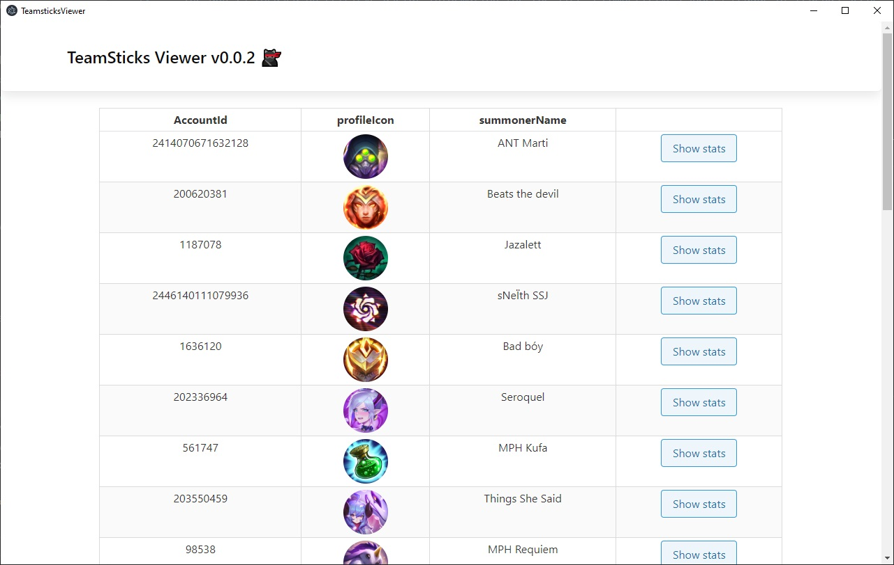
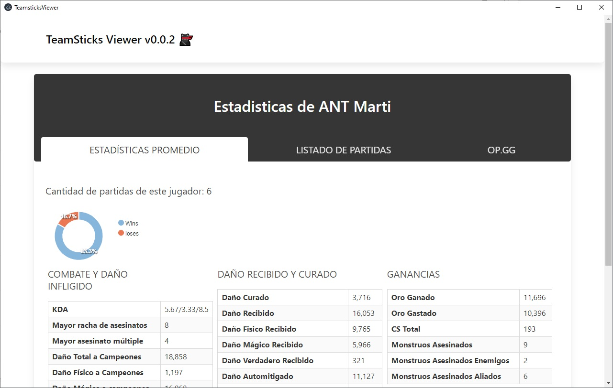
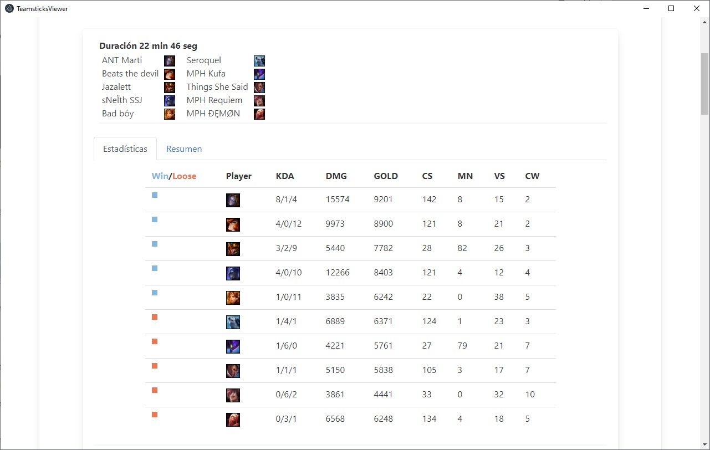

# Teamsticks 🐱‍👤

**_The app is focused on retrieve useful information for the Tier 3 competitive esports League of Legends scene._**





# Teamsticks Viewer 🐱‍👤

_This desktop app is used to view the retrieved data from the League of Legends client._

A few things you should know:

* (2021-04) Currently League of Legends is going through big changes on it's client, therefore this app is currently not working since matchlist endpoint is deprecated at the moment.
* App doesn't have a loading bar and heroku free tier is kind of slow, so just wait a bit.
* This app is still work in progress.
* You can check the working app since my heroku server is online. Run:
```
npm run electron
```
## Starting 🚀

_This app serves as a front end for all the data retrieved by Teamsticks-Client_
For a fully working app you need four things up:

* Teamsticks-Client
* Teamsticks-Backend mounted on a server like heroku.
* This Client to view the data.
* A MongoDB server running.

Look **Deployment** to know how to start the project.


### Pre-requirements 📋

_You need the MongoDB server running and Teamsticks Backend running for this app to work_


### Deployment 🔧

_Download the project and install all dependencies_


```
npm install
```

_Modify api http adress on [global.ts](src\app\services\global.ts)_
_package the app_

```
npm run electron-build
```

_new folder with working app will be created_


## Developed in 🛠️


* [Angular](https://angular.io/)
* [Electron](https://www.electronjs.org/)
* [Apexcharts](https://apexcharts.com/)
* [Bulma](https://bulma.io)
* [ng-bootstrap](bootstrap.github.io)


## Author ✒️


* **Luca de Acha** - [Github](https://github.com/T-NAVe) - [LinkedIn](https://www.linkedin.com/in/luca-de-acha/)


## License 📄

This project is under MIT-license check [MIT-LICENSE.txt](MIT-LICENSE.txt) for details.

## Thanks to 🎁

* Big shout out to Riot Games Third Party Developer Community [Discord](https://discord.com/invite/riotgamesdevrel)📢
